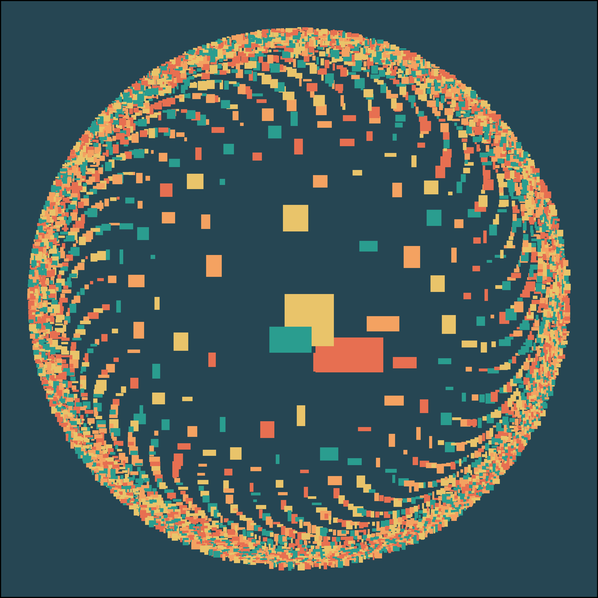

This a repository dedicated for my efforts for [genuary](https://genuary.art/) . You can find out what the prompts were editions I've participated:

* [2021 edition prompts](https://genuary2021.github.io/prompts)
* [2022 edition prompts](https://genuary2022.github.io/prompts)

## 2021 edition

### JAN.1 Triple nested loop
</img>

### JAN.2 Rule 30 (elementary cellular automaton)
</img>

### JAN.3 Make something human.
</img>

### JAN.5 Do some code golf! How little code can you write to make something interesting? Share the sketch and its code together if you can.
</img>

### JAN.6 Triangle subdivision.
</img>

### JAN.8 Curve only.
</img>

### JAN.9 Interference patterns.
</img>

### JAN.17 Draw a line, pick a new color, move a bit.
</img>

### JAN.20 No loops.
</img>

### JAN.21 
function f(x) { 
    DRAW(x); 
    f(1 * x / 4); 
    f(2 * x / 4); 
    f(3 * x / 4); 
}
</img>
</img>

### JAN.23 #264653 #2a9d8f #e9c46a #f4a261 #e76f51, no gradients.
</img>

### JAN.24 500 lines.
</img>

### JAN.25 Make a grid of permutations of something.
</img>

### JAN.29 Any shape, none can touch.
</img>

### JAN.30 Replicate a natural concept (e.g. gravity, flocking, path following).
</img>

### JAN.31 "ENO'S OBLIQUE STRATEGIES": Breathe more deeply
</img>

## 2022 edition

### JAN.1 Draw 10,000 of something.
</img>

### JAN.2 Dithering.
</img>

### JAN.5 Destroy a square.
</img>

### JAN.9 Architecture.
</img>

### JAN.15 Sand.
</img>

### JAN.25 Perspective.
</img>

### JAN.29 Isometric perspective.
</img>
